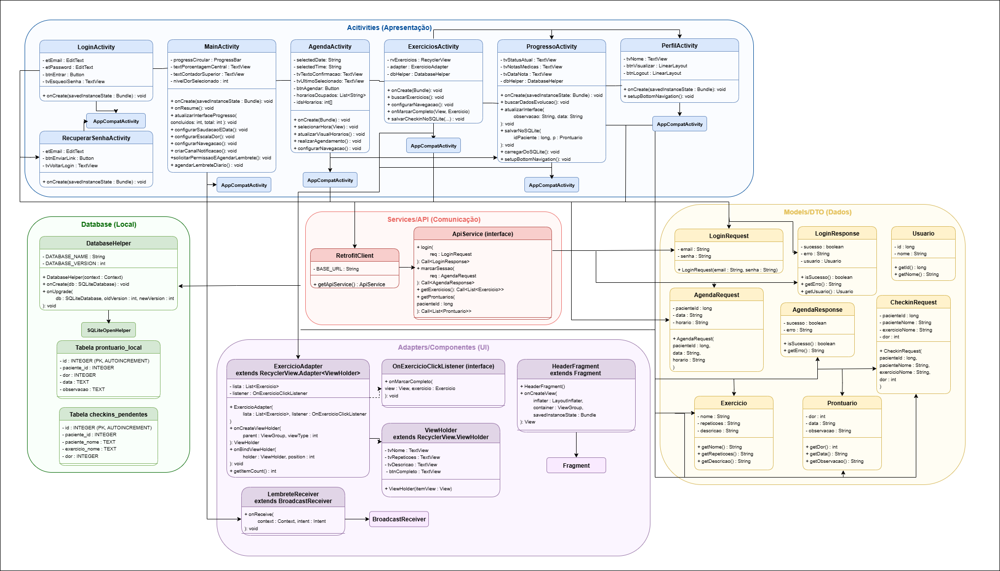

# 📘 Diagrama de Classes — AlinhaTech App

## 🩺 Descrição
Este diagrama de classes representa a estrutura do aplicativo **RPG Clinic**, desenvolvido em Android Studio utilizando Java.  

O sistema possui funcionalidades de:

- 🔐 Login de usuários
- 📅 Agendamento de sessões
- 🏋️ Registro de exercícios
- 📈 Controle de progresso do paciente
- 👤 Perfil do usuário
- 💾 Persistência local com SQLite
- 🌐 Comunicação com API utilizando Retrofit
- 🔔 Notificações e lembretes diários

---

## 📊 Diagrama de Classes

Abaixo está a representação visual da estrutura do sistema:



---

# 🏗️ Estrutura do Projeto

## 📱 Activities
Responsáveis pelas telas principais do aplicativo:

- `LoginActivity`
- `MainActivity`
- `AgendaActivity`
- `ExerciciosActivity`
- `PerfilActivity`
- `ProgressoActivity`
- `RecuperarSenhaActivity`

Todas herdam de:

```text
AppCompatActivity
```

---

## 🧩 Fragment

```text
HeaderFragment
```

Responsável pelo componente reutilizável de cabeçalho da interface.

---

## 🔔 Broadcast Receiver

```text
LembreteReceiver
```

Responsável pelo envio de notificações diárias de lembrete dos exercícios.

---

# 💾 Database

```text
DatabaseHelper
```

Classe responsável pelo gerenciamento do banco de dados SQLite local.

## 📂 Tabelas
- `prontuario_local`
- `checkins_pendentes`

---

# 🌐 API / Services

## 🚀 RetrofitClient
Responsável pela configuração e conexão com a API.

## 🔌 ApiService
Interface que define os endpoints utilizados pelo sistema:

- Login
- Agendamento
- Exercícios
- Check-ins
- Prontuários

---

# 🧱 Adapters

## 📋 ExercicioAdapter
Responsável pela renderização da lista de exercícios no RecyclerView.

## 🪟 ViewHolder
Responsável pelo armazenamento das referências visuais dos itens da lista.

## 🎯 OnExercicioClickListener
Interface utilizada para capturar eventos de clique nos exercícios.

---

# 📦 Models / DTOs

Classes responsáveis pela transferência e armazenamento de dados:

- `LoginRequest`
- `LoginResponse`
- `Usuario`
- `AgendaRequest`
- `AgendaResponse`
- `CheckinRequest`
- `Exercicio`
- `Prontuario`

---

# 🔗 Relacionamentos UML

## 🧬 Herança
Representada por:

```text
─────▷
```

Exemplo:

```text
MainActivity ─────▷ AppCompatActivity
```

---

## 🔄 Associação / Uso
Representada por:

```text
─────→
```

Exemplo:

```text
LoginActivity ─────→ RetrofitClient
```

---

## 🧩 Implementação de Interface
Representada por:

```text
─ ─ ─▷
```

Exemplo:

```text
ExercicioAdapter ─ ─ ─▷ OnExercicioClickListener
```

---

# 🛠️ Tecnologias Utilizadas

- ☕ Java
- 📱 Android SDK
- 💾 SQLite
- 🌐 Retrofit
- 📋 RecyclerView
- 🧠 SharedPreferences
- 🔔 Notifications API

---

# 🎯 Objetivo do Diagrama

O diagrama de classes tem como objetivo demonstrar:

- 📌 Estrutura geral do sistema
- 🧩 Organização das responsabilidades
- 🔗 Relações entre classes
- 🔄 Fluxo de comunicação entre componentes
- 🏛️ Arquitetura do aplicativo
